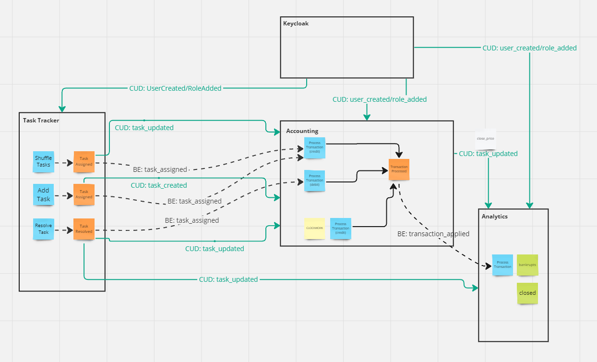

# aTES

## Установка:
1) Запустите приложение с помощью команды:
```bash
docker-compose up
```

2) Настройка Keycloak:
- Перейдите по адресу http://localhost:7000/auth
- Активируйте события webhook в пользовательском интерфейсе администратора, перейдя в раздел Configure Realm Settings > Events tab > Event Listeners, в раскрывающемся списке слушателей событий выберите ext-event-webhook и сохраните изменения.
- Добавьте клиенты: task_tracker, accounting, analytics
- Создайте роль "popug"
- Добавьте пользователей с ролью "popug"

## Ссылки:
- TaskTracker: [http://localhost:9000](http://localhost:9000)
- Accounting: [http://localhost:10000](http://localhost:10000)
- Analytics: [http://localhost:11000](http://localhost:11000)

## Схема:
### Event Storming

### Модель данных

### Сервисы
